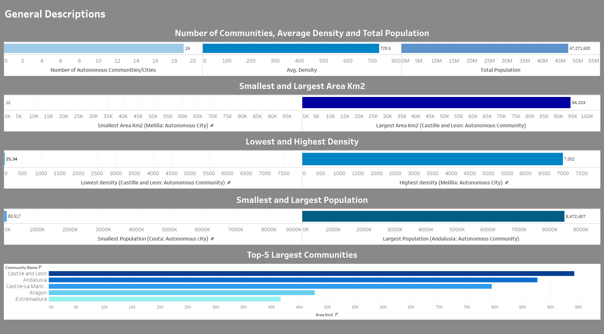
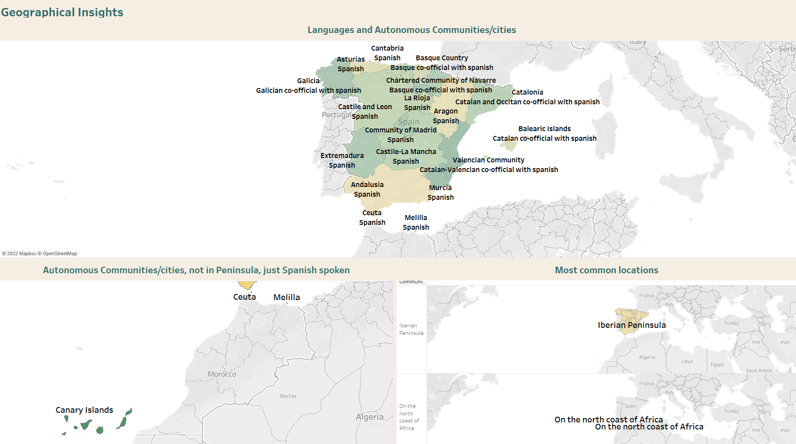
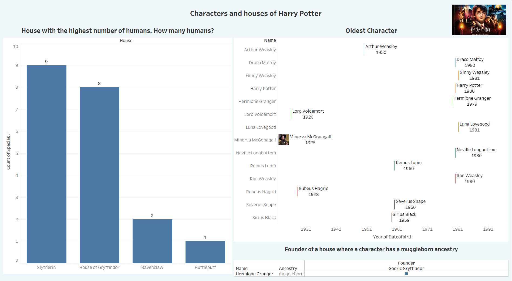

# 📋 TeachT3ch Project

## 📜 Winter Sessions

### 📝 Lesson

- SQL 101

### 🤵 Lecturers

- Jose Manuel Navarro. CTO
- David Torres. Senior Data Science/Engineer

### ✍ Assignments

1. By using the IDE we worked with in class:

- Create a table with at least 5 rows and 5 columns.
- Write at least 5 queries about the data.

2. Answer the following questions by using the IDE and tables we worked with in class. Besides, show the queries you wrote to get your results.

- Who is the oldest character?
- Which house has the highest number of human characters? How many are they?
- Who is the house founder with a character who has an ancestry "muggleborn"?

### 💻 Solutions

1. **First exercise

- Two tables were created. They show different aspects about Autonomous Communities/Cities in Spain . [First Exercise repo](first_excersise.sql)
- Some insights on the data can be seen on the next dashboards.

#### Dashboard 1.1 General Description

#### Dashboard 1.2 Gegraphical Description

### 📚 Bibliography (First exercise)

- Data and inforamation were retrieved from the sites below

- [Autonomous communities of Spain](https://simple.wikipedia.org/wiki/Autonomous_communities_of_Spain)
- [Spain](https://en.wikipedia.org/wiki/Spain#cite_note-c-4)
- [Anexo: Comunidades y ciudades autónomas de España](https://es.wikipedia.org/wiki/Anexo:Comunidades_y_ciudades_aut%C3%B3nomas_de_Espa%C3%B1a)

2. **Second Exercise

- The tables/information provided in class were used in order to get the solutions. [Second exercise solution repo](second_excersise.sql)
- Some insights on the data are presented on the next dashboard

#### Dashboard 2.1 Harry Potter characters/houses

### 📚 Bibliography (Second exercise)

- Data were extracted from the tables and information provided in class.

### 🔧 Tools

- PostgreSQL
- Tableau
- Visual Studio Code
- Git
- Github repository

### ⭐ Thanks TeachT3ch Team 🏅
